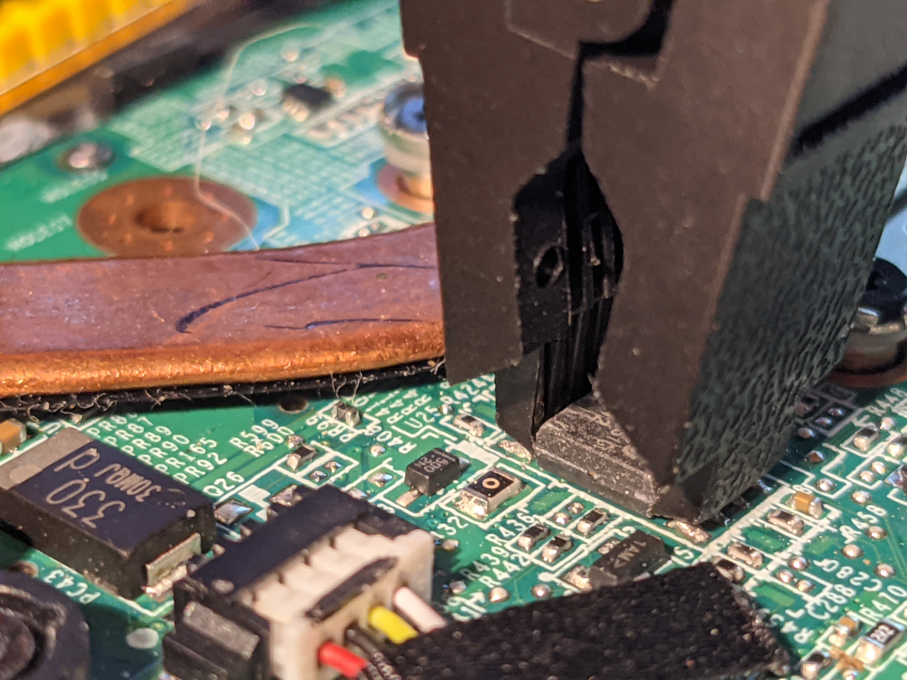
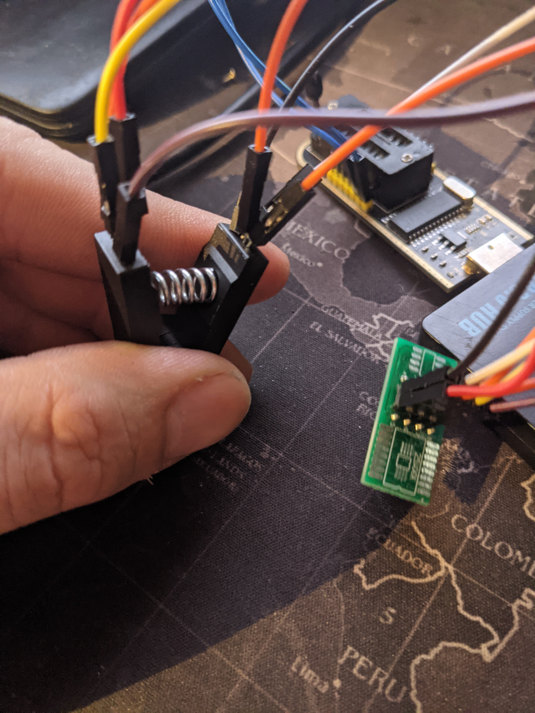
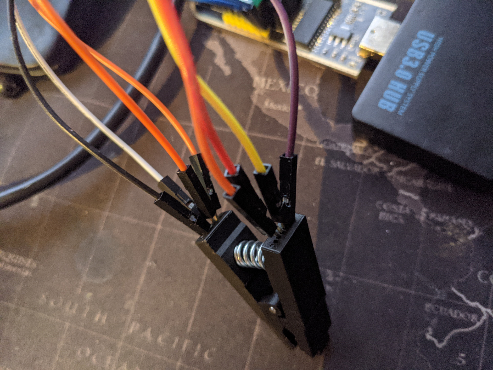
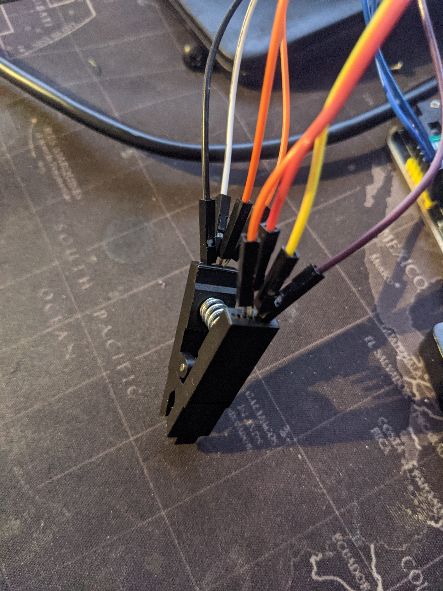
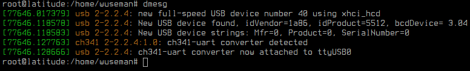
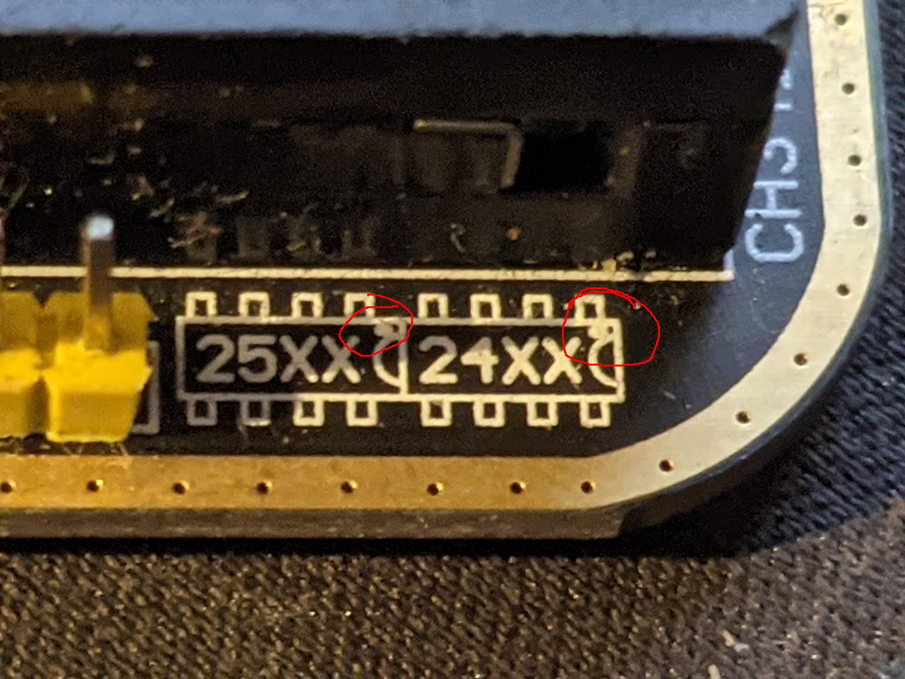

# Acer (Chromebook) - C740

This repository is created for To share with me knowledge and everything is done for educational purposes. I take no responsibility whatsoever over other users' responsibility and I urge no one to use these methods to bypass and remotely lock the chromebook.

### Unbrick a bad flash / Bypass a remote locked Chromebook (Acer C740) wich will be my device for show and give you examples, it works same for all laptops no matter what sytem you run.

I always want to find out what's going on on the other side and not only know how to get things done but because I love learning new things and then I need to know how it goes when locking a chromebook as an administrator, so if if you want to learn more, you can create a Google Admin account that costs some money, but it's worth it, so you do not have to speculate about what your chef / teacher can see, but I will not address that here and now. until later. A chromebook that is first via the remote control and leaves a message on the screen that the device should te.x return to X and on the phone number X so the serial number must be changed, this is how they lock the device and it is possible to get past by flashing bios with a new rom. For this you need three things.

1. Bios Programmer (I use ch341a myself) 
2. One 8 soic clip (recommended: don't buy a cheap one, they will last 1-3 times then you wont be able to attach the clipper again and it is annoying something extreme so go for a 3M one)
3. A new rom (this can be found on variou places online)

Either you can buy a fixed clip or you can connect cables as I do in the banner.

### A pre-fixed clip + contact (price for this is usually ~1€->3€, you can get over them cheaper but in avg this is the price)

### A custom made clip if you are really poor you can get a clip from ~0.1$

##### How should i place pins?

#### CH341 as a programmer OR a reader

From store, you will get a jumper for pins, hence my own jump on the picture but when 1&2 are bracked the device is conifgured as a programmer:

If you remove the jumper the ch341 is a serial console reader, as a TTL Serial Converter (ftdi rs232, for example) adapter:

The dot i marked is were the VOLTAGE should be, this is really really important otherwise your ship may burn:

#### Flashing:

First we must find the right clip, this was easy for this device since there is a page on chromiums website (this can be hard to find otherwise if youre new to this)

So we just place our clip on the IC chip

#### Reading flash

